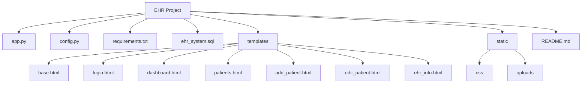

Electronic Health Record (EHR) Information System
Project Overview

This repository contains the source code for an Electronic Health Record (EHR) Information System developed as part of the Information Systems course (Semester WS 25/26). The system is designed to assist doctors in managing patient information in a structured, secure, and digital environment.

The application follows a full-stack architecture consisting of a frontend user interface, a backend server application, and a relational database. Each component was developed separately by different group members and later merged into a single unified system.

System Architecture

The Electronic Health Record system follows a three-tier architecture that separates responsibilities across the frontend, backend, and database layers. This design improves maintainability, clarity, and scalability.

Frontend Layer

The frontend layer represents the presentation layer of the system. It provides doctors with an intuitive interface to manage patient records, appointments, and clinical documentation.

The frontend is implemented using HTML, CSS, Bootstrap, and Jinja2 templates integrated with Flask. Server-side rendering is used to dynamically display data retrieved from the backend. User interactions such as form submissions and navigation actions generate HTTP requests that are sent to the backend for processing.

Backend Layer

The backend layer contains the core application logic. It is responsible for handling HTTP requests, managing authentication and sessions, validating user input, and coordinating communication between the frontend and the database.

The backend is implemented using Python and the Flask web framework. Access control mechanisms ensure that only authenticated users can access protected routes. Business logic related to patient management, visit tracking, and revisit scheduling is handled at this layer.

Database Layer

The database layer provides persistent storage for all system data. A MySQL relational database is used to store doctor accounts, patient records, visit information, clinical documentation, and appointment data.

The database schema is designed with well-defined tables and relationships that reflect real-world healthcare workflows. Foreign key constraints and indexing are used to maintain data integrity and improve query performance. Radiology images are stored on disk, while references to these files are stored in the database.

Component Interaction

User actions on the frontend are processed by the backend, which applies application logic and communicates with the database. Retrieved data is then sent back to the frontend and rendered dynamically. This interaction ensures a clear separation of concerns between system components.

Features

Doctor registration and login

Secure authentication and session management

Patient record management (create, read, update, delete)

Visit scheduling and visit status tracking

Clinical documentation including symptoms, diagnosis, and SOAP notes

Revisit scheduling for follow-up appointments

Radiology image upload and storage

Dashboard overview of patients and upcoming visits

Technology Stack

Frontend: HTML, CSS, Bootstrap, Jinja2

Backend: Python, Flask

Database: MySQL

Project Structure
## Project Structure



Setup and Installation
Prerequisites

Python 3.x

MySQL

pip (Python package manager)

Steps

Clone the repository:
```
git clone <repository-url>

```
Navigate to the project directory:
```
cd ehr-system
```

Install required dependencies:
```
pip install -r requirements.txt
```

Create the database:
```
CREATE DATABASE ehr_system;
```

Import the database schema:
```
mysql -u <username> -p ehr_system < ehr_system.sql
```

Configure database credentials in config.py.

Run the application:
```
python app.py
```

Open a browser and access:
```
http://localhost:5000
```
Group Contributions

This project was completed as a group assignment. Each member worked independently on a specific component of the system.

Frontend Development: John Baby Nayathodan

Database Design and Implementation: Tanjib Alim Bhuiyan

Backend Architecture and Implementation: Joyel Raju
